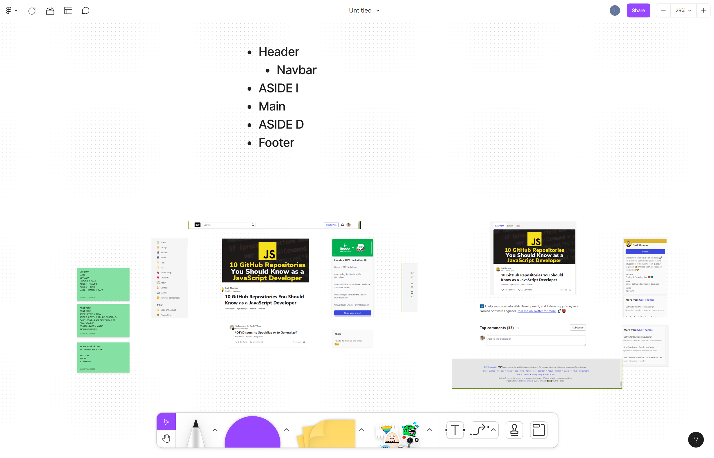
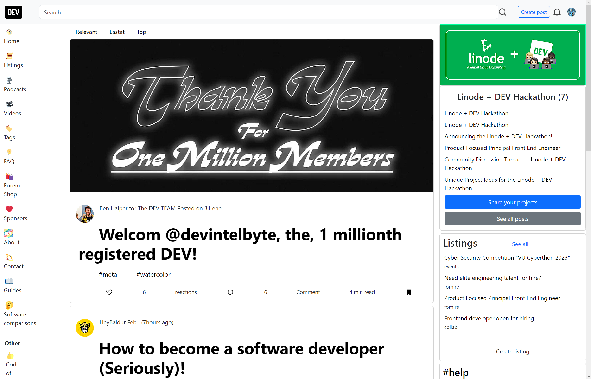

# Dev.to-Challenge-24JS-Kodemia

This is a copy of the Dev.to website made with the help of boostrap, recreating it as closely as possible

## Bootstrap

[Bootstrap](https://getbootstrap.com/) is a free, open source front-end development framework for the creation of websites and web apps. Designed to enable responsive development of mobile-first websites, Bootstrap provides a collection of syntax for template designs.

## Screenshot

This's the screenshot of the planing stage of the challenge

And this's the screenshot of the challenge being displayed in a browser

## Credits

[Iyari](https://github.com/MaestroMiyagi) 🦞

[Mario](https://github.com/mariomesm) :christmas_tree:

[Rafa](https://github.com/Rafaelvi03) :santa:
